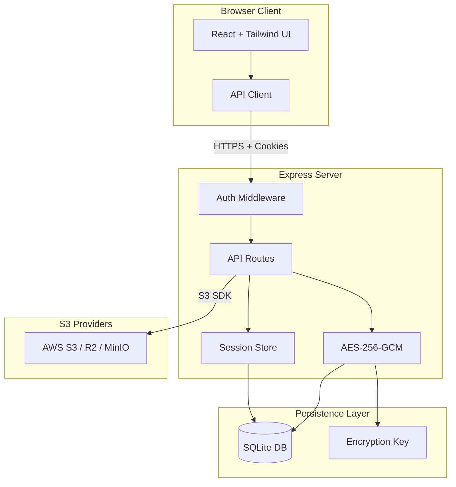

<small>

## S3 Explorer

A secure, self-hosted web-based file manager for S3-compatible storage buckets.

[](https://railway.com/deploy/s3-explorer)
[](LICENSE.md)
[](https://github.com/subratomandal/s3explorer)

### Overview

Managing S3 buckets often requires command-line tools or provider-specific dashboards that vary significantly in usability. S3 Explorer unifies this experience by offering a single, consistent web interface to upload, download, and organize files across any S3-compatible provider.

Supported Providers:

1. Railway Buckets
2. AWS S3
3. Google Cloud Storage
4. Cloudflare R2
5. MinIO
6. DigitalOcean Spaces

### Screenshots

<p>
  
</p>

<p>
  
</p>

<p>
  
</p>

### Architecture



### Security Features

1. Password Auth: Single password via env var or setup wizard (Argon2id hashed)
2. Encrypted Credentials: S3 credentials encrypted at rest with AES-256-GCM
3. Secure Sessions: Server-side SQLite sessions with httpOnly + sameSite=strict cookies (secure flag auto-enabled over HTTPS)
4. Rate Limiting: IP-based, 10 attempts per 15 min, 30 min lockout
5. Security Headers: Helmet.js enabled (CSP, HSTS, etc.)
6. No Client Storage: Credentials never stored in browser localStorage

### Features

#### File Management

1. Drag-and-drop file uploads
2. Create folders for organization
3. Rename files and folders
4. Delete files and folders with confirmation
5. Batch select and delete multiple items
6. Download files through secure server proxy
7. In-browser file preview

#### Multi-Connection Support

1. Store up to 100 S3 connections
2. Instant switching between connections
3. All credentials encrypted server-side

#### Keyboard Navigation

1. `Cmd+K` / `Ctrl+K`: Open command palette
2. `Cmd+,` / `Ctrl+,`: Open connection manager
3. `Cmd+U` / `Ctrl+U`: Upload files
4. `Escape`: Close active modal

### Deployment

#### Railway (Recommended)

[](https://railway.com/deploy/s3-explorer)

1. Fork repo
2. New project → Deploy from GitHub
3. Add volume: mount path `/data`
4. Set environment variables:
   1. `APP_PASSWORD`: Strong password (12+ chars, mixed case, numbers, symbols)
   2. `SESSION_SECRET`: Random 32+ character string (use `openssl rand -hex 32`)

Or skip these and configure through the setup wizard on first launch.

#### Docker

```bash
docker run -d --name s3explorer --restart unless-stopped -p 3000:3000 -e APP_PASSWORD='YourStr0ng!Pass#2024' -e SESSION_SECRET="$(openssl rand -hex 32)" -v s3explorer_data:/data ghcr.io/subratomandal/s3explorer:latest
```

#### Docker Compose

```yaml
services:
  s3-explorer:
    image: ghcr.io/subratomandal/s3explorer:latest
    restart: unless-stopped
    ports:
      - "3000:3000"
    environment:
      - APP_PASSWORD=YourStr0ng!Pass#2024
      - SESSION_SECRET= # Generate with: openssl rand -hex 32
    volumes:
      - s3explorer_data:/data

volumes:
  s3explorer_data:
```

> Set `SESSION_SECRET` to the output of `openssl rand -hex 32`. Do not use the example passwords in production.

#### Local Development

```bash
npm run install:all

export APP_PASSWORD='DevPassword123!'
export SESSION_SECRET='dev-secret-not-for-production-use!!'
export DATA_DIR='./data'

npm run dev
```

Backend runs on :3000, frontend on :5173.

### Environment Variables

1. `APP_PASSWORD` (optional): Login password. Must be 12+ chars with upper, lower, number, special char. If not set, a setup wizard will appear on first launch to configure it.
2. `SESSION_SECRET` (optional): Session signing key. Use `openssl rand -hex 32`. If not set, a random secret is generated (sessions will be lost on server restart). Can also be configured through the setup wizard.
3. `DATA_DIR` (optional): SQLite/key storage path. Default: `/data`
4. `PORT` (optional): Server port. Default: `3000`
5. `NODE_ENV` (optional): Environment (`production` / `development`)

### Provider Setup Guide

#### Railway Buckets

1. Create a Bucket in your Railway project canvas
2. Go to the Bucket's Credentials tab
3. Use values:
   1. Endpoint: Your Bucket endpoint from the Credentials tab
   2. Access Key: Your Bucket Access Key ID
   3. Secret Key: Your Bucket Secret Access Key

#### Cloudflare R2

1. Go to Cloudflare Dashboard → R2 Object Storage
2. Click Manage R2 API Tokens
3. Create token with Admin Read & Write permissions
4. Use values:
   1. Endpoint: `https://<account_id>.r2.cloudflarestorage.com`
   2. Access Key: Your R2 Access Key ID
   3. Secret Key: Your R2 Secret Access Key

#### AWS S3

1. Go to AWS Console → IAM
2. Create user with `AmazonS3FullAccess` policy
3. Create access key under Security Credentials
4. Use values:
   1. Endpoint: `https://s3.<region>.amazonaws.com`
   2. Access Key: Generated Access Key ID
   3. Secret Key: Generated Secret Access Key

#### Google Cloud Storage

1. Go to Google Cloud Console → Cloud Storage → Settings → Interoperability
2. Create an HMAC key under your user account or a service account
3. Use values:
   1. Endpoint: `https://storage.googleapis.com`
   2. Access Key: Generated HMAC Access Key
   3. Secret Key: Generated HMAC Secret
   4. Bucket Name: Required — GCS interop requires the connection scoped to one bucket

#### DigitalOcean Spaces

1. Go to DigitalOcean Dashboard → Spaces Object Storage
2. Navigate to API → Spaces Keys
3. Generate new key
4. Use values:
   1. Endpoint: `https://<region>.digitaloceanspaces.com` (e.g., `https://nyc3.digitaloceanspaces.com`)
   2. Access Key: Generated Spaces Access Key
   3. Secret Key: Generated Spaces Secret Key

#### MinIO

1. Access your MinIO console
2. Navigate to Access Keys
3. Create new access key
4. Use values:
   1. Endpoint: Your MinIO URL (e.g., `https://minio.example.com`)
   2. Access Key: Generated Access Key
   3. Secret Key: Generated Secret Key

### Stack

1. Frontend: React, Tailwind, Vite
2. Backend: Express, TypeScript
3. Database: SQLite (better-sqlite3)
4. Auth: Argon2, express-session

### License

MIT

Created by [@subratomandal](https://github.com/subratomandal)

</small>
